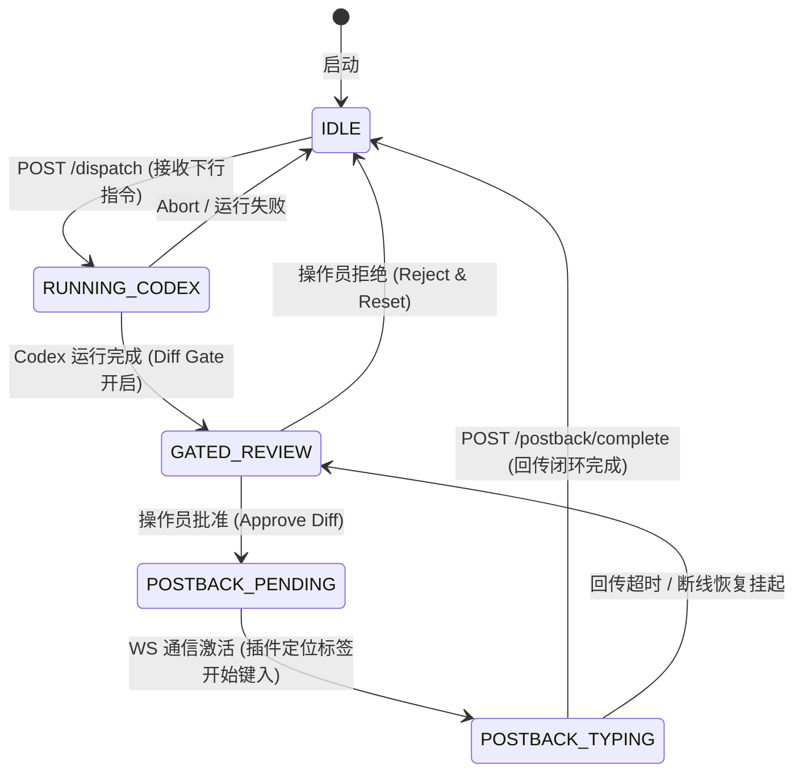

# JJ AI Dispatcher — Phase 4+ Visible Closed Loop Extension Technical Design

## 1. Project Purpose (项目宗旨)

JJ AI Dispatcher 的核心定位始终是**人机协同的高效执行系统**，而不是一个完全脱离人类掌控的黑盒 Autonomous Agent。

在这个体系中，各角色的定位非常明确：
```text
ChatGPT decides.       (ChatGPT 决策)
Dispatcher controls.   (Dispatcher 控制)
Codex edits.           (Codex 编码修改)
Git records.           (Git 审计与保存)
Browser postback.      (浏览器回传状态)
Operator sees.         (操作员实时监督)
```

本扩展设计的核心目标是**打通反馈闭环 (Close the Loop)**。使 ChatGPT 不仅能通过 MCP 协议向下发送指令，还能在 Dispatcher/Codex 执行完成后，**自动、可视化地接收到执行结果与 Git Diffs**，从而彻底消除操作员手动复制日志、粘贴回 ChatGPT、再复制新指令的繁琐操作。

---

## 2. Relationship to Existing Dispatcher Bridge Design (与现有设计的关系)

本设计是 `TECHNICAL_DESIGN_CHATGPT_DISPATCHER_BRIDGE.md` 的**无缝扩展**而非替代。

- **不影响现有 Result Contract**：继续使用已实现的 `task.json`、`result.json`、`summary.md`、`git-diff.patch` 等标准构件。
- **不破坏现有 Local HTTP Bridge**：保持现有的 `POST /dispatch` 和 `GET /runs/*` 接口原样运行。
- **新增模块**：引入 **Browser Session Controller (浏览器会话控制器)** 与 **Browser Postback Adapter (浏览器回传适配器)**，在 Dispatcher 执行流程的末端挂接“主动回传”管道。

---

## 3. Core Problem Revisited (核心痛点重申)

### 3.1 Passive ChatGPT Problem (被动的 ChatGPT 网页端)
目前的 ChatGPT 网页端（特别是使用 Custom GPTs 或标准 Web 界面时）是**被动的 (Passive)**。它无法在后台启动轮询机制（Polling）去不断请求本地 HTTP Bridge 的 `/runs/latest`。
一旦 Dispatcher 开始调度 Codex 运行，ChatGPT 便进入等待状态。如果执行耗时较长，ChatGPT 无法主动得知“任务已完成”，必须等待操作员手动输入或点击才能触发下一轮思考。

### 3.2 Why MCP Polling Alone is Not Enough (为什么仅靠 MCP 轮询不够)
在标准 MCP (Model Context Protocol) 规范中，工具调用是同步且短暂的。若任务运行时间超过数分钟，同步的 MCP Tool 调用可能会超时；而异步的 MCP 机制在缺乏客户端（网页端）主动循环触发的前提下，仍然无法让 Passive Brain 主动苏醒。

### 3.3 Why Browser Postback is Needed (为什么需要浏览器回传)
为了实现真正的闭环，必须建立一条**反向推送通道**。当 Dispatcher 监测到 Codex 完成修改并由 Git 提交后，直接驱动一个处于操作员视线内的浏览器会话，自动将生成的 `summary.md` 和 `git-diff.patch` 键入当前对话框并提交。这样便能立刻唤醒 ChatGPT，使其自主审查结果并输出下一步动作。

---

## 4. Visible Closed Loop Architecture (可视化闭环架构)

整个系统的双向通信架构如下：

```text
┌────────────────────────────────────────────────────────────────────────┐
│                          ChatGPT Web Session                           │
│                                                                        │
│     Command Trigger                  ▲           Active Web Postback   │
│     (MCP Tool Invoke)                │           (Typing & Send)       │
└─────────────┬────────────────────────┼─────────────────────▲───────────┘
              │                        │                     │
              ▼                        │                     │
┌───────────────────────────┐          │          ┌──────────┴───────────┐
│     MCP Host Server       │          │          │   Browser Postback   │
│     (mcp/server.js)       │          │          │   Adapter (JS/CDP)   │
└─────────────┬─────────────┘          │          └──────────▲───────────┘
              │                        │                     │
              ▼                        │                     │
┌───────────────────────────┐          │          ┌──────────┴───────────┐
│   JJ Dispatcher Bridge    │          │          │   Browser Session    │
│    (HTTP 127.0.0.1)       │          │          │      Controller      │
└─────────────┬─────────────┘          │          └──────────▲───────────┘
              │                        │                     │
              ▼                        │                     │
┌───────────────────────────┐          │                     │
│      Dispatcher Core      │          │                     │
│      (run.ps1 / CLI)      ├──────────┼─────────────────────┘
└─────────────┬─────────────┘          │  Trigger Postback
              │                        │  with Artifacts
              ▼                        │
┌───────────────────────────┐          │
│         Codex CLI         ├──────────┘
│     (Files modified)      │
└───────────────────────────┘
```

---

## 5. Command Path (下行指令路径)

下行指令路径遵循现有的可靠控制流：
1. **决策阶段**：ChatGPT Web 决定需要修改代码，调用注册的 MCP Tool `dispatch_task`。
2. **中转阶段**：MCP Server 接收到请求，构造标准 JSON 荷载，POST 到本地 HTTP Bridge (`http://127.0.0.1:8787/dispatch`)。
3. **执行阶段**：Bridge 启动 `dispatcher/run.ps1`，锁定目标仓库，生成任务描述文件，并调用 Codex CLI。
4. **记录阶段**：Codex 完成修改，Dispatcher 验证变更，自动提交 Git，生成包含 `summary.md` 和 `git-diff.patch` 的 Runs 归档。

---

## 6. Feedback Path (上行反馈路径)

当任务执行完毕（无论成功或失败），上行反馈路径随即被激活：
1. **事件触发**：Dispatcher 检测到 Codex 执行结束，且 Git 状态已更新。
2. **组装载荷**：读取当前 Task Run 的 `result.json`、`summary.md` 与 `git-diff.patch`。
3. **唤醒控制器**：Dispatcher 通过本地接口通知 **Browser Session Controller**。
4. **定位会话**：Controller 寻找当前的 ChatGPT 浏览器标签页。
5. **执行注入**：**Browser Postback Adapter** 将格式化后的 Summary 及 Diff 自动键入 ChatGPT 的输入框，并模拟点击发送。
6. **Brain 响应**：ChatGPT 接收到推送的结构化数据，自动开始审查，并产生新一轮决策。

---

## 7. Browser Session Controller (浏览器会话控制器)

为了不干扰操作员的标准浏览器使用，同时保障会话状态（Cookies/登录态）的一致性，Browser Session Controller 采用**双轨定位策略**：

1. **CDP Mode (Chrome DevTools Protocol)**
   - 监听或附加到操作员已启动的、带有远程调试端口（例如 `--remote-debugging-port=9222`）的 Chrome 实例。
   - 能够安全地读取当前打开的 `chatgpt.com` 标签页，并复用已登录的 Web 状态。
2. **Local Browser Extension Mode (本地浏览器插件模式 - 推荐)**
   - 一个轻量级的 Chrome 开发者插件，后台与本地 Dispatcher Bridge 保持 WebSockets/HTTP 保持连接。
   - 插件通过 `chrome.tabs` API 实时捕获当前处于活跃状态 of ChatGPT 对话，接收 Dispatcher 的回传数据，并利用 DOM 注入完成发送。

### 7.3 标签会话绑定（UUID Binding）
为了防止多标签页混淆，下行 MCP 调用时会提取并记录 ChatGPT 当前 Conversation URL 中的 UUID（例如：`chatgpt.com/c/<conversation-uuid>`）。Browser Session Controller 将此 UUID 写入 `task.json` 并在 Postback 时检索，通过插件或 CDP 精准定位该 UUID 所在的标签页，确保数据不会跨会话“串线”。

---

## 8. Browser Postback Adapter (浏览器回传适配器)

适配器负责消除机器与网页 DOM 之间的阻抗。它具备以下技术特征：

- **DOM 弹性定位**：ChatGPT 网页端经常更新 DOM 结构。适配器不依赖易变的混淆 CSS 类名，而是通过多重弹性 Selector 过滤：
  - 寻找具有 `role="textbox"` 且 `contenteditable="true"` 的交互容器。
  - 通过 `placeholder` 包含 "ChatGPT" 或 "Message" 等特征的元素。
  - 兜底使用 React 内部 fiber 树的内部节点寻址。
- **打字抖动仿真 (Simulated Typing with Jitter)**：避免一次性将上万字插入 DOM 导致网页卡死或被平台 Anti-Bot 判定为恶意流量。适配器模拟真实键盘输入事件（KeyDown/KeyPress/KeyUp/Input），在句子（句号、逗号）结束处增加 50ms - 150ms 的随机时间抖动（Jitter），使其更贴近人手输入行为。
- **Payload 优化裁剪与 MCP 懒加载 (Lazy Diff Loading)**：
  - 如果 `git-diff.patch` 极长，直接全部键入会导致 ChatGPT 上下文窗口耗尽（Token Bloat）并导致浏览器页面渲染卡死。
  - 适配器在 Postback 时会对其进行**智能截断**，只回传 `summary.md` 与变更的元数据列表（如受影响文件和修改行数统计）。
  - 在 Payload 中留下索引，并配合下行的 MCP 文件读取工具，引导 ChatGPT 在需要详细分析某文件时主动调用 `read_git_diff(file='path')` 进行**懒加载**。

---

## 9. Postback Modes (回传模式)

为了适应不同的工作节奏，系统提供三种回传模式，操作员可在 Local UI 或启动参数中进行切换：

### 9.1 Review Mode (人工确认模式 - 推荐默认)
- **行为**：Dispatcher 将执行结果、Summary 和 Diff 自动填充到 ChatGPT 的输入框中，并高亮闪烁提示操作员，但**不自动点击发送**。
- **价值**：操作员拥有一万分的控制权，可以在肉眼确认一切安全无误后，手动按下 Enter 键。这同时也是最自然地绕过任何反作弊防线的防御方式。

### 9.2 Visible Auto Mode (可视化自动模式)
- **行为**：Dispatcher 自动填充输入框，并在延时 3-5 秒后模拟点击“发送”按钮。
- **价值**：实现真正解放双手的“无缝闭环”，操作员只需像看电影一样盯着 VSCode 和浏览器窗口交替运行。

### 9.3 Silent Mode (静默后台模式)
- **行为**：无需可见的浏览器界面，直接利用持久化 Session Cookie，在后台通过 HTTP 请求将数据发送至 ChatGPT Web 对应的 Conversation API 接口。
- **价值**：极致的速度与极简的桌面占用，但需要高强度的 Token/Cookie 维护。

---

## 10. VSCode Visible Codex Execution (VSCode 可视化 Codex 执行)

双向闭环的极致体验在于**双视窗并排工作**：

```text
┌─────────────────────────────┬──────────────────────────────┐
│ VSCode (左侧窗口)           │ ChatGPT Web (右侧窗口)       │
│                             │                              │
│ ◌ Codex Running…            │ ✍ Dispatcher postback typing │
│ [Modified] README.md        │   "Here is the diff summary: │
│ [Modified] bridge.js        │    - Added endpoint /health  │
│                             │    - Fixed token issue..."   │
│ █ terminal log streaming    │                              │
│ > git commit -m "feat:..."  │ ◌ ChatGPT reviewing diff...  │
│ > Target Repo tree updated  │ ◌ Next action generating...  │
└─────────────────────────────┴──────────────────────────────┘
```

操作员的本地 VSCode 视窗充当**现场监视器**。Codex 修改文件、终端输出滚动、Git 自动 Commit 的过程实时可见，而右侧的浏览器则自动展示 AI Brain 的审阅与下一步规划，形成完美的协同张力。

---

## 11. Operator Command Center (操作员控制中心)

在本地 Bridge 端口（默认 `http://127.0.0.1:8787`）之上，新增一个极简且富有科技感的可视化 Web 仪表盘。

- **实时状态卡片**：展示当前 Dispatcher 状态（`IDLE`、`RUNNING_CODEX`、`COMMITTING`、`POSTBACK_TYPING`、`PAUSED`）。
- **任务排队视图**：列出当前正在处理的任务以及 Runs 历史归档。
- **会话监视窗**：显示当前 Browser Session Controller 的连接状态与活跃的 ChatGPT Tab URL。

---

## 12. Human Control Layer (人类干预控制层)

为了防范 AI 执行失控，操作员可以通过控制中心、CLI 或全局热键进行即时干预：

### 12.1 Pause (暂停)
挂起当前的执行队列或回传队列。此时，Dispatcher 保持中间态，操作员可慢条斯理地进行代码排查。

### 12.2 Abort (中止)
立即强杀正在运行的 Codex CLI 进程，撤销所有尚未提交的临时修改（通过 `git reset --hard` 与 `git clean -fd`），并将系统置回安全警戒线。

### 12.3 Takeover (人工接管)
切断所有自动回传与自动提交。操作员可以直接在控制台手动敲击指令，或者直接在 ChatGPT 网页中手动回复，系统在检测到操作员手工干预后，自动切换为被动待命模式。

### 12.4 Diff Gate (差分验证闸门)
一个强制安全阀。在 Codex 运行完毕后，Dispatcher 必须挂起，**必须**由操作员在 Command Center 的 UI 上点击 "Approve Diff" 按钮后，才会继续执行 Git Commit 与浏览器回传。

---

## 13. Replay Mode (回放模式)

由于所有的执行记录均保存在 `dispatcher/runs/<task-id>/` 目录下：
- 操作员可以通过命令 `.\dispatcher\ask -replay 20260525-153012` 重新拉起指定任务。
- 系统会重新加载当年的 `summary.md` 与 `git-diff.patch`，并重新尝试通过 Browser Postback 发送给 ChatGPT。
- 这对于调试复杂的提示词链路、测试新版本的 Postback 适配器，或在对话中断后恢复会话状态极为有用。

---

## 14. Auto Handover Seed (自动交接种子)

当一个 ChatGPT 会话因为 Context 过长而变得迟钝，或者操作员需要更换干净的会话时：
1. Dispatcher 能够自动整理出当前的“交接上下文” (Handover Seed)。
2. Handover Seed 包含：当前仓库 of 完整 Git 状态、已完成的阶段目标、待解决的任务清单，以及最新的 `summary.md`。
3. 浏览器适配器会自动在新开的 ChatGPT 对话窗口中输入此 Seed，使新会话在 1 秒内无缝继承前任的全部记忆。

---

## 15. Worker Competition Mode (工匠竞争模式)

Dispatcher 并不孤立地依赖某一个 Codex 实例。
- **机制**：Dispatcher 可以针对同一个 Task Prompt，并行或串行地分发给不同的 Coding Workers（如：Codex A 擅长快速实现，Codex B 擅长严格重构，或者调用不同的本地大模型）。
- **结果呈现**：Dispatcher 收集它们各自生成的 Git Diffs，通过本地 UI 以并排对比（Side-by-Side Diff）的形式展示给操作员，甚至将竞争方案的摘要同时 Postback 给 ChatGPT，由 AI Brain 进行多方案优劣评估。

---

## 16. AI Pair Review (AI 双子联审)

在结果回传给 ChatGPT Web 之前，Dispatcher 可以增加一道“内部预审门槛”：
- 调度一个处于只读模式的本地轻量级 Review Agent。
- 对 Codex 生成的 `git-diff.patch` 进行静态代码扫描与潜在 Bug 评估。
- 将 Review Agent 的意见作为附加元数据（Metadata）合并写入 `summary.md` 中，让 ChatGPT Web 在接收到反馈时，能获得多角度、更客观的事实依据。

---

## 17. Proxima Evaluation (Proxima 会话通信层评估)

### 17.1 Proxima 角色定位
在业界实践中，**Proxima** 作为一种专门用于浏览器/会话层 AI 通信的工具，展现了极强的会话生命周期维护与 DOM 键入自动化能力。

### 17.2 JJ Dispatcher 与 Proxima 的共生关系
- **JJ Dispatcher 的本质**：是**本地执行与 Git 控制中心**，掌控物理文件、编译环境与代码提交的绝对控制权。
- **Proxima 的引入方式**：我们不会盲目用其替换 Dispatcher。相反，我们可以将 Proxima 作为一个**高精度浏览器驱动适配器**吸纳进来。
- **技术借力**：如果本地开发的 Puppeteer 脚本在应对 ChatGPT 网页版的动态反爬、复杂 DOM 嵌套或 WebSocket 维持时出现不稳定，可以评估并封装 Proxima 库，由 Dispatcher 在 Feedback 阶段调用 Proxima 的 API 来代替原生的 CDP 驱动，从而加速回传通道的建设。

---

## 18. Future Worker Communication Layer (未来 Worker 通信层演进)

长期来看，闭环体系的反馈通路可以扩展至多个大模型会话终端：

```text
┌────────────────────────────────────────────────────────┐
│                   JJ AI Dispatcher                     │
└───────────────────────────┬────────────────────────────┘
                            │
              ┌─────────────┼─────────────┐
              ▼             ▼             ▼
        ┌───────────┐ ┌───────────┐ ┌───────────┐
        │ ChatGPT   │ │   Claude  │ │  Gemini   │
        │ Web/API   │ │  Session  │ │  Session  │
        └───────────┘ └───────────┘ └───────────┘
```

通过抽象出标准的 **BrainSessionConnector** 接口，Dispatcher 未来将能够通过统一的协议同时调度 ChatGPT Web 对话、Claude artifacts 页面或 Gemini 讨论区，实现跨多脑协同的分布式执行环境。

---

## 19. Revised Phase Expansion (修订后的阶段拓展路线图)

结合闭环需求，JJ AI Dispatcher 的整体路线图拓展为以下七个阶段：

- **Phase 1: Dispatcher Core (已完成)**
  - 核心调度器、代码修改管道与 Git 控制节点就位。
- **Phase 2: Operator CLI (已完成)**
  - `ask.ps1` 命令行就位，提供丰富的手动操作入口。
- **Phase 3: Result Contract & Local Bridge (已完成)**
  - 交付 `result.json`/`summary.md` 规范，实现本地单任务 `/dispatch` HTTP 接口与 Token 硬化。
- **Phase 4: Visible Feedback Loop (当前重点规划)**
  - 研发 Browser Session Controller 与 Postback Adapter，打通 Review Mode 与 Visible Auto Mode，消灭人工复制粘贴。
- **Phase 5: Browser Session Worker Control**
  - 支持多会话并行调度、自动 Handover Seed 管理与 Proxima 适配器集成。
- **Phase 6: Visual Operator Control Center**
  - 交付本地 Web 仪表盘，引入强制 Diff Gate、Pause、Abort 及 Takeover 安全防护卡口。
- **Phase 7: Multi-worker & Pair Review**
  - 引入工匠竞争模式、只读预审 Agent，形成多工匠、多脑联审的企业级协同网络。

---

## 20. Safety Rules (金科玉律：安全第一原则)

为了保证整个闭环系统在自动化推进时绝对不会对操作员的数据、隐私或财产造成损害，系统内置以下**硬安全规则**：

1. **白名单 URL 限制 (Domain Whitelist)**
   - Browser Controller 仅被允许连接与操作 `https://chatgpt.com`、`https://claude.ai` 等受信任的 AI 服务页面。严禁访问或跳转至任何外部非授权网址。
2. **严禁自动处理敏感信息 (No Credential Input)**
   - 系统绝不自动输入密码、验证码、双重认证（2FA）令牌。如果遇到需要认证的场景，系统必须挂起并等待操作员在物理键盘上输入。
3. **严禁触碰金融与毁灭性行为 (No Payment or Destructive Actions)**
   - 严禁浏览器驱动访问任何银行、支付网关、云服务计费管理页面，或执行可能导致实体账号注销、大额消费的操作。
4. **无暴露裸 Shell 权限 (No Raw Shell Exposure)**
   - ChatGPT 传回的指令必须经过 Dispatcher 预定义的 Schema 校验（如只能是指定格式的任务包），严禁直接将 ChatGPT 生成的任意 Bash/PowerShell 字符串在没有 Diff Gate 确认的情况下送入物理终端执行。
5. **全程可审计的证据链 (Audit Logs & Screenshots)**
   - 浏览器的每一次 Typing、Click 以及状态变迁，都必须记录在 `dispatcher/runs/<task-id>/browser-action.log` 中。在调试模式下，回传适配器会在发送前自动截取浏览器当前画面并保存为 `evidence.png`，以供审查。
6. **操作员可见性优先 (Operator-Visible Preference)**
   - 除非操作员明确指定静默模式，否则系统默认且强烈推荐采用**前台可见窗口运行**。让操作员能清晰看到浏览器的每一个动作，随时准备拍下 Space 键或点击 Abort 按钮终止运行。

---

## 21. Key Technical Challenges & Mitigation Strategies (工程实现挑战与规避对策)

### 21.1 网页 DOM 的动态易碎性 (Dynamic DOM Breakages)
* **风险**：大模型服务商（如 OpenAI）会频繁重构前端页面并使用随机混淆的样式类名，导致死板的 CSS Selector 频繁失效。
* **规避对策**：回传适配器采用 **语义化多维过滤定位**，聚焦于 `role="textbox"`、`contenteditable="true"` 和 ARIA 占位符进行逻辑判定。此外，引入本地 Chrome 插件作为主要控制端，绕过外部脚本的安全限制并保障 DOM 寻址的鲁棒性。

### 21.2 大面积差分引发的 Token 膨胀与卡顿 (Context Bloat)
* **风险**：大面积代码改动会产生极长的 Git Diff。若一次性模拟填入输入框，会导致浏览器卡死崩溃，并极快耗尽 ChatGPT 会话的 Token 记忆上限。
* **规避对策**：采用 **Summary 优先与 Diff 懒加载 (Lazy Loading)** 的混合架构。回传时只在输入框写入结构化的 `summary.md` 和简短变更元数据（列出文件和修改行数统计）。大段的 Patch 隐藏在后台，引导 ChatGPT 在需要深度审查时调用下行的 MCP 文件读取工具按需索取。

### 21.3 多标签页串联与会话路由错乱 (Session UUID Binding)
* **风险**：当操作员在浏览器中打开了多个 ChatGPT Tab 时，后台回传可能无法对应到当前具体执行任务的会话，造成结果串线和逻辑错乱。
* **规避对策**：实施 **UUID 唯一标签页锁定**。在 ChatGPT 触发 MCP 的瞬间，下行流量会自动记录并绑定当前 Tab URL 中的 Conversation UUID（例如：`/c/<conversation-uuid>`）。上行回传时，Session Controller 会优先遍历当前打开的所有标签页，定位到 UUID 匹配的 Tab 页面，并将其强制聚焦后再开始模拟注入。

### 21.4 Anti-Bot 防护与频率限制 (Anti-Bot & Rate Limits)
* **风险**：短时间内发送海量数据或极为死板的批量键入动作，极易触发大模型平台的 Anti-Bot 人机防护（如 CAPTCHA、Cloudflare 盾或平台封禁）。
* **规避对策**：采用 **打字抖动算法 (Simulated Jitter)**。每次模拟击键的间隔时间随机在 10ms - 30ms 间游走，遇到特殊字符、标点符号时自动停顿 80ms - 200ms。对于大规模数据，系统默认采用 **Review Mode**（后台将内容填好，不触发 Click Send，完全由操作员手动敲下 Enter 键，彻底消除防刷隐患）。

---

## 23. Complete API & Protocol Schemas (完整接口与协议 Schema)

为了保证下行指令端与上行浏览器回传端数据传递的高内聚、低耦合，扩展设计定义了三套核心接口契约：

### 23.1 POST /postback (Dispatcher 发送到 Bridge 的上行回传请求)
当 Dispatcher Core 执行 Codex 完毕并归档 Runs 目录后，由 PowerShell 执行器向 Local Bridge 发送以下 POST 数据：

* **Endpoint**: `POST http://127.0.0.1:8787/postback`
* **Headers**:
  ```http
  Content-Type: application/json
  X-Dispatcher-Token: [TOKEN_HASH_STRING]
  ```
* **JSON Payload Schema**:
  ```json
  {
    "taskId": "20260529-024839-a9b8",
    "conversationUuid": "52857b2b-09ef-4bf2-be75-dcf45c7e1967",
    "status": "success",
    "postbackMode": "review",
    "payload": {
      "summaryPath": "runs/20260529-024839-a9b8/summary.md",
      "summaryContent": "# Dispatcher Run Summary\n\nTask ID: 20260529-024839-a9b8\nStatus: success\n\n## Task\n...",
      "metadata": {
        "filesChanged": ["README.md", "dispatcher/bridge.ps1"],
        "linesAdded": 34,
        "linesDeleted": 12,
        "commitHash": "a8c9d2f"
      },
      "hasMoreDiff": true
    }
  }
  ```

### 23.2 GET /postback/pending (Chrome 插件拉取挂起任务)
本地 Chrome 插件通过周期性轮询（Long Polling）或与 Bridge 的 Server-Sent Events (SSE) 通信，获取当前在等待回传的队列信息：

* **Endpoint**: `GET http://127.0.0.1:8787/postback/pending`
* **Response (HTTP 200 - 有挂起任务)**:
  ```json
  {
    "hasPending": true,
    "task": {
      "taskId": "20260529-024839-a9b8",
      "conversationUuid": "52857b2b-09ef-4bf2-be75-dcf45c7e1967",
      "postbackMode": "review",
      "contentToType": "# Dispatcher Run Summary\n\nTask ID: 20260529-024839-a9b8\nStatus: success\n...\n\n[Diff has been truncated. Use MCP 'read_git_diff' to query detail.]"
    }
  }
  ```
* **Response (HTTP 200 - 无挂起任务)**:
  ```json
  {
    "hasPending": false,
    "task": null
  }
  ```

### 23.3 POST /postback/complete (插件报告回传注入成功)
插件在 ChatGPT 页面输入框成功输入并置入完毕后，向 Local Bridge 发送状态反馈以闭合状态机：

* **Endpoint**: `POST http://127.0.0.1:8787/postback/complete`
* **JSON Payload Schema**:
  ```json
  {
    "taskId": "20260529-024839-a9b8",
    "status": "completed",
    "timestamp": "2026-05-29T02:48:39+08:00"
  }
  ```

---

## 24. Chrome Extension Blueprint (轻量级浏览器插件架构)

本地浏览器插件承担了真正的物理操纵任务，结构清晰独立：

```text
mcp-browser-connector/
├── manifest.json         # 注册与权限声明
├── background.js         # 持久后台服务（维护 WebSocket 与 Bridge 状态）
├── content.js            # ChatGPT 网页页面的 DOM 操作与打字仿真引擎
└── options.html          # 本地 Bridge 端口及 Token 配置界面
```

### 24.1 manifest.json (清单声明)
```json
{
  "manifest_version": 3,
  "name": "JJ Dispatcher Browser Connector",
  "version": "1.0.0",
  "description": "Bridges local Dispatcher executions back to ChatGPT visible session.",
  "permissions": [
    "tabs",
    "activeTab",
    "storage"
  ],
  "host_permissions": [
    "https://chatgpt.com/*",
    "http://127.0.0.1:8787/*"
  ],
  "background": {
    "service_worker": "background.js"
  },
  "content_scripts": [
    {
      "matches": ["https://chatgpt.com/*"],
      "js": ["content.js"],
      "run_at": "document_idle"
    }
  ]
}
```

### 24.2 background.js (后台管理器逻辑骨架)
```javascript
// background.js - WebSocket Connection and Task routing
let bridgeSocket = null;
const BRIDGE_WS_URL = "ws://127.0.0.1:8787/session-channel";

function connectToBridge() {
  bridgeSocket = new WebSocket(BRIDGE_WS_URL);

  bridgeSocket.onopen = () => {
    console.log("[Extension] Connected to Dispatcher Local Bridge WS.");
  };

  bridgeSocket.onmessage = async (event) => {
    const message = JSON.parse(event.data);
    if (message.type === "POSTBACK_TRIGGER") {
      // 路由任务到具体的 Content Script
      routePostbackTask(message.task);
    }
  };

  bridgeSocket.onclose = () => {
    console.warn("[Extension] Connection closed. Retrying in 5s...");
    setTimeout(connectToBridge, 5000);
  };
}

async function routePostbackTask(task) {
  const tabs = await chrome.tabs.query({ url: "*://chatgpt.com/*" });
  let targetTab = null;

  // 根据 UUID 精准配对标签页
  for (const tab of tabs) {
    if (tab.url.includes(task.conversationUuid)) {
      targetTab = tab;
      break;
    }
  }

  // 兜底：若未匹配到 UUID，则路由至当前活跃页面
  if (!targetTab && tabs.length > 0) {
    targetTab = tabs[0];
  }

  if (targetTab) {
    // 强制跳转/聚焦至目标标签
    await chrome.tabs.update(targetTab.id, { active: true });
    // 发送回传载荷给该标签的 Content Script 注入执行
    chrome.tabs.sendMessage(targetTab.id, {
      action: "INJECT_POSTBACK",
      task: task
    });
  } else {
    console.error("[Extension] No active ChatGPT session tab found for routing.");
  }
}

connectToBridge();
```

---

## 25. Resilient Typing Simulation Algorithm (弹性打字机算法实现逻辑)

在 `content.js` 中，直接设置输入框的 `.value` 并点击发送按钮极易被 React 或底层 Single-Page 状态管理器抛弃，导致页面无响应或报错。适配器使用多维弹性 DOM 控制与打字机防抖逻辑。

### 25.1 弹性打字及发送逻辑实现 (content.js)
```javascript
// content.js - DOM Interaction & Simulated Typing Jitter
chrome.runtime.onMessage.addListener((request, sender, sendResponse) => {
  if (request.action === "INJECT_POSTBACK") {
    executePostback(request.task);
  }
});

async function executePostback(task) {
  console.log("[Postback] Locating text inputs...");
  const textbox = locatePromptTextbox();

  if (!textbox) {
    console.error("[Postback] Failed to locate text area.");
    return;
  }

  // 1. 聚焦文本框并准备输入
  textbox.focus();
  
  // 2. 模拟高保真打字输入，规避 React 状态丢失
  await simulateTyping(textbox, task.contentToType);

  // 3. 根据回传模式决定是自动提交还是闪烁提示操作员
  if (task.postbackMode === "auto") {
    console.log("[Postback] Auto mode. Waiting 3s before click...");
    await delay(3000);
    clickSendButton();
  } else {
    console.log("[Postback] Review mode. Flashing textbox border for attention.");
    flashBorder(textbox);
  }
  
  // 4. 反馈状态
  chrome.runtime.sendMessage({ action: "REPORT_COMPLETE", taskId: task.taskId });
}

// 弹性选择器组
function locatePromptTextbox() {
  return (
    document.querySelector("#prompt-textarea") ||
    document.querySelector('div[contenteditable="true"]') ||
    document.querySelector('textarea[placeholder*="ChatGPT"]') ||
    document.querySelector('textarea[placeholder*="Message"]')
  );
}

// 模拟打字机按键注入
async function simulateTyping(element, text) {
  element.focus();
  
  // 兼容标准 textarea 与 contenteditable 容器
  const isContentEditable = element.getAttribute("contenteditable") === "true";
  
  // 抹平清空逻辑
  if (isContentEditable) {
    element.innerHTML = "";
  } else {
    element.value = "";
  }

  for (let i = 0; i < text.length; i++) {
    const char = text[i];
    
    // 生成标准的按键事件流
    const keydown = new KeyboardEvent("keydown", { key: char, bubbles: true });
    const keypress = new KeyboardEvent("keypress", { key: char, bubbles: true });
    const input = new InputEvent("input", { inputType: "insertText", data: char, bubbles: true });
    
    element.dispatchEvent(keydown);
    element.dispatchEvent(keypress);
    
    if (isContentEditable) {
      document.execCommand("insertText", false, char);
    } else {
      element.value += char;
    }
    
    element.dispatchEvent(input);
    
    const keyup = new KeyboardEvent("keyup", { key: char, bubbles: true });
    element.dispatchEvent(keyup);

    // 随机键入防刷抖动
    let baseDelay = 15; // 默认打字速度（毫秒）
    if (char === "." || char === "," || char === "\n") {
      baseDelay += Math.floor(Math.random() * 120 + 80); // 标点符号处增加明显停顿
    } else {
      baseDelay += Math.floor(Math.random() * 15 - 5);  // 微小速度抖动
    }
    
    await delay(baseDelay);
  }
}

// 寻找并触发发送按钮
function clickSendButton() {
  const sendButton = 
    document.querySelector('button[data-testid="send-button"]') ||
    document.querySelector('button[aria-label="Send message"]') ||
    document.querySelector('button[disabled="false"]') ||
    document.querySelector('button.mb-1');
    
  if (sendButton) {
    sendButton.click();
  } else {
    // 兜底：如果在 DOM 中未定位到按钮，则直接在 textbox 触发 Enter
    const textbox = locatePromptTextbox();
    if (textbox) {
      const enterDown = new KeyboardEvent("keydown", { key: "Enter", keyCode: 13, bubbles: true });
      textbox.dispatchEvent(enterDown);
    }
  }
}

function delay(ms) {
  return new Promise(resolve => setTimeout(resolve, ms));
}

function flashBorder(element) {
  let count = 0;
  const interval = setInterval(() => {
    element.style.outline = count % 2 === 0 ? "3px solid #10a37f" : "none";
    if (++count > 6) {
      clearInterval(interval);
      element.style.outline = "none";
    }
  }, 300);
}
```

---

## 26. Complete Event Sequence Timeline (完整事件流转时序图)

双向闭环设计中，上下行数据与操作员干预在时间线上的交叉流转过程如下：

```text
 ChatGPT Web Tab             MCP Host Server       Local Bridge API        Dispatcher Core & Codex CLI
      │                            │                       │                           │
      │ 1. Trigger Dispatch Tool   │                       │                           │
      ├───────────────────────────>│                       │                           │
      │                            │ 2. POST /dispatch     │                           │
      │                            ├──────────────────────>│                           │
      │                            │                       │ 3. Spawn pwsh run.ps1     │
      │                            │                       ├──────────────────────────>│
      │                            │                       │                           │ 4. Run Codex Worker
      │                            │                       │                           │ (Edit Local Files)
      │                            │                       │                           │──┐
      │                            │                       │                           │  │
      │                            │                       │                           │<─┘
      │                            │                       │                           │ 5. Perform Git Commit
      │                            │                       │                           │    & Create Artifacts
      │                            │                       │ 6. POST /postback (result)│
      │                            │                       |<──────────────────────────┤
      │                            │                       │                           │
      │                            │                       │ 7. WS: POSTBACK_TRIGGER   │
      │  8. [Extension Background] │                       │ (Tab UUID matched)        │
      │  Intercepts WS & routing   │<──────────────────────┤                           │
      │──────────────┐             │                       │                           │
      │              │             │                       │                           │
      │<─────────────┘             │                       │                           │
      │                            │                       │                           │
      │ 9. Inject Simulative       │                       │                           │
      │    Typing (Summary)        │                       │                           │
      │──┐                         │                       │                           │
      │  │ (Typing... with Jitter) │                       │                           │
      │<─┘                         │                       │                           │
      │                            │                       │                           │
      │ 10. Click Send / Enter     │                       │                           │
      │──┐                         │                       │                           │
      │  │ (Active Loop Complete)  │                       │                           │
      │<─┘                         │                       │                           │
      │                            │                       │                           │
      │ 11. ChatGPT reviews and    │                       │                           │
      │     decides next phase     │                       │                           │
      V                            V                       V                           V
```

---

## 27. Dispatcher State Machine (状态机与任务状态变迁)

为了安全协调多并发请求和人工干预，Local Bridge 内部维护了一个严密的状态机。状态机的生命周期节点如下：



### 27.1 核心状态说明
* **IDLE（空闲）**：系统就绪，接受新一轮的 `POST /dispatch` 触发。
* **RUNNING_CODEX（正执行物理编码）**：后台正在调用 Codex 对目标代码库进行修改与验证。此时拒绝新的 `POST /dispatch` 请求（返回 HTTP 409 Busy）。
* **GATED_REVIEW（差分确认闸门激活）**：文件已修改并被 Dispatcher 提交至 Git 临时区，等待操作员在本地仪表盘（Command Center）上进行确认。
* **POSTBACK_PENDING（等待浏览器回传）**：操作员已批准，回传数据已拼装就绪，处于本地 Bridge 的挂起队列中，等待 Chrome 插件拉取。
* **POSTBACK_TYPING（浏览器键入中）**：插件已锁定对应的 UUID 标签页并正在模拟打字机输入，此时系统锁定防止其他任务写入，直到收到 `/postback/complete` 或发生断线超时。

---

## 28. Lazy Diff MCP Tool Contract (MCP 懒加载工具契约)

如 `21.2` 节所规划，为了防止大段 Git Diff 瞬间撑爆 ChatGPT 会话记忆上限并造成网页卡死，系统设计了**懒加载读取工具**，由大模型在有需要时主动反向调用。

### 28.1 Tool: fetch_run_diff
大模型在接收到 `summary.md` 变更索引后，若决定深入审查代码，会向本地 MCP Host 派发该工具调用。

* **JSON Schema 定义 (Tool Definition)**:
  ```json
  {
    "name": "fetch_run_diff",
    "description": "Lazy load detailed git diff patches for a specific completed run task.",
    "input_schema": {
      "type": "OBJECT",
      "properties": {
        "taskId": {
          "type": "STRING",
          "description": "The unique ID of the target run task (e.g. '20260529-024839-a9b8')"
        },
        "filePath": {
          "type": "STRING",
          "description": "Optional. The specific file path to fetch diff for. If omitted, returns structural diff stats of all modified files."
        },
        "maxLines": {
          "type": "INTEGER",
          "description": "Optional. Limit the maximum lines of the returned diff content. Defaults to 200.",
          "default": 200
        }
      },
      "required": ["taskId"]
    }
  }
  ```

* **大模型调用实例**:
  ```json
  {
    "name": "fetch_run_diff",
    "arguments": {
      "taskId": "20260529-024839-a9b8",
      "filePath": "dispatcher/bridge.ps1",
      "maxLines": 100
    }
  }
  ```

* **MCP Host 输出响应**:
  ```json
  {
    "status": "success",
    "taskId": "20260529-024839-a9b8",
    "file": "dispatcher/bridge.ps1",
    "diffPatch": "@@ -125,7 +125,7 @@\n function Update-BridgeTaskState {\n-    if ($State.TaskState -eq \"running\" -and $null -ne $State.ActiveProcess) {\n+    if ($State.TaskState -eq \"running\" -and $null -ne $State.ActiveProcess -and $State.ActiveProcess.HasExited) {\n..."
  }
  ```

---

## 29. Local Configuration Expansion (`config.json` 扩展配置说明)

为了让操作员能灵活调节闭环行为，本地配置文件 `dispatcher/config.json` 进行了参数槽位扩展：

```json
{
  "bridge": {
    "enabled": true,
    "host": "127.0.0.1",
    "port": 8787,
    "requireToken": true,
    "token": "a1b2c3d4e5f6g7h8i9j0"
  },
  "postback": {
    "enabled": true,
    "defaultMode": "review",
    "wsEnabled": true,
    "maxContentLength": 6000,
    "antiBotDelayBaseMs": 15,
    "diffLineCutoffThreshold": 150
  }
}
```

### 29.1 参数解析
* **`defaultMode`** (`review` | `auto` | `silent`)：规定回传默认模式。生产环境强力推荐 `review`，保障安全与 Anti-Bot 稳定性。
* **`maxContentLength`**：单次打字回传允许的最大字符长度，超过此长度的 Diff 内容会被自动截断，代之以 lazy load 引导词。
* **`antiBotDelayBaseMs`**：模拟按键输入的基础间隔毫秒数。
* **`diffLineCutoffThreshold`**：触发懒加载的 Git Diff 行数阈值，单文件 Diff 超过该行数时将被强制折叠，由 ChatGPT 动态拉取。

---

## 30. Postback Fault Tolerance & Error Recovery (回传容错与断线恢复机制)

自动化键入可能受限于网络抖动、页面崩溃、浏览器标签页被意外关闭等物理环境扰动。设计加入了**断线恢复与幂等保障协议**：

### 30.1 心跳维持与超时重设 (Heartbeat & Typing Timeout)
* 插件 background.js 与 Bridge 之间每 5 秒发送一次心跳包（Ping/Pong）。
* 在 `POSTBACK_TYPING` 状态下，系统启动一个 120 秒的硬计时保护。若 120 秒内插件未报送 `/postback/complete`（可能由于页面卡死或被意外关闭），Bridge 自动撤销锁定，将任务重新置回 `GATED_REVIEW` 或 `POSTBACK_PENDING` 状态，以便重新拉起回放。

### 30.2 幂等性防护 (Idempotency Guard)
* 每一笔回传请求都带有唯一的 `taskId`。
* 插件 `content.js` 在向 ChatGPT 输入框注入内容前，会读取当前输入框内已有的残留文字，若发现已存在包含该 `taskId` 标识的 Summary 头，将直接跳过输入动作并汇报 `complete`，以防由于网络瞬间重连导致重复打字注入。

---

## 22. Final Vision (终极愿景)

通过引入 Phase 4+ 可视化闭环设计，**JJ AI Dispatcher** 从一个简单的本地脚本工具，蜕变成一个**对人类操作员完全透明、随时可被中断、极度安全且高效 of AI 执行环境**。

在这个愿景中，代码的每次编写都落在 Git 的牢固审计下，每一次任务的流转都在操作员的实时注视中。这不仅消除了操作员的手工负担，更在 AI 的无限自主权与人类的绝对控制力之间，构筑了一道稳固而优雅的技术拱桥。
